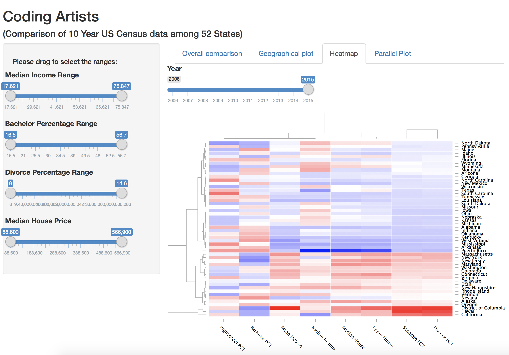

Project Prototype: CodingArtists
==============================

Plot and compare 10 year US Census data(based on states): income, education, marital status, and house price


| **Name**  | Lin Chen  | Jennifer Zhu |
|----------:|:------------:|:-------------|
| **Email** | lchen74@usfca.edu | xzhu31@usfca.edu |

Instructions
----------------------

The following packages must be installed prior to running this code:

- `googleVis`
- `shiny`
- `GGally`
- `plotly`
- `d3heatmap`
- `shinythemes`
- `dplyr`
- `tidyr`


To run this code, please enter the following commands in R:

```
library(shiny)
shiny::runGitHub("CodingArtists-final", "usfviz")
```

This will start the `shiny` app. See below for details on how to interact with the visualization.


Discussion 
--------------------

Below are four screenshots of the interface of the shiny app.





## Data Set
10 year US Census data(based on states): income, education, marital status, and house price.

## Techniques
We used ggplot2 (a lot of choices of plot types, layouts, and customized options), plotly (specifically good for some interactive charts in terms of the pretty layouts and annotations), and d3heatmap (for heat maps) to generate high-quality plots.

## UI
We have four tabs to show different plots with sliderbars to filter the states based on the range of four variables. Additionally, we include the opition of years and states for some of the plots. 

## Summary
Based on the 10 year census data, our shiny app use different tabs and/or interactive options to visualize the comparision of income, education, marital status, and house price among states as well as within a state over time. Here we are proud to present the final version of our shiny app. We have refined the layouts, colors, contents, interactions, and details. Hope you enjoy it!
