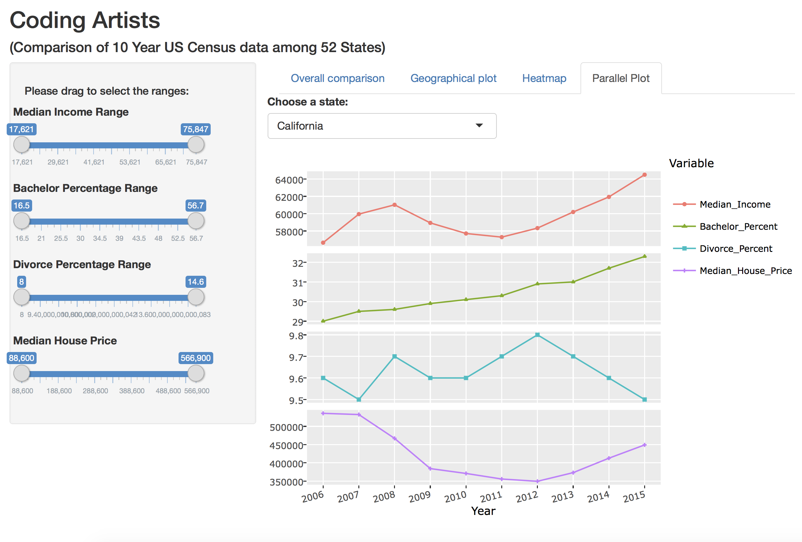

Project Prototype: CodingArtists
==============================

Plot and compare 10 year US Census data(based on states): income, education, marital status, and house price


| **Name**  | Lin Chen  | Jennifer Zhu |
|----------:|:------------:|:-------------|
| **Email** | lchen74@usfca.edu | xzhu31@usfca.edu |

Instructions
----------------------

The following packages must be installed prior to running this code:

- `googleVis`
- `shiny`
- `GGally`
- `plotly`
- `d3heatmap`
- `shinythemes`
- `dplyr`


To run this code, please enter the following commands in R:

```
library(shiny)
shiny::runGitHub('usfviz', 'CodingArtists', subdir='project-prototype')
```

This will start the `shiny` app. See below for details on how to interact with the visualization.


Discussion 
--------------------

Below are three screenshots of the interface of the shiny app.




## Data Set
10 year US Census data(based on states): income, education, marital status, and house price.

## Techniques
We used ggplot2 (a lot of choices of plot types, layouts, and customized options), plotly (specifically good for some interactive charts in terms of the pretty layouts and annotations), and d3heatmap (for heat maps) to generate high-quality plots.

## UI
We have three tabs to show different plots with some sliderbars. It looks slightly messy since we have too many variables to tune. We will work on improve the UI next.

## Summary
We would liike to refine the current version of shiny app with better layouts and details.
